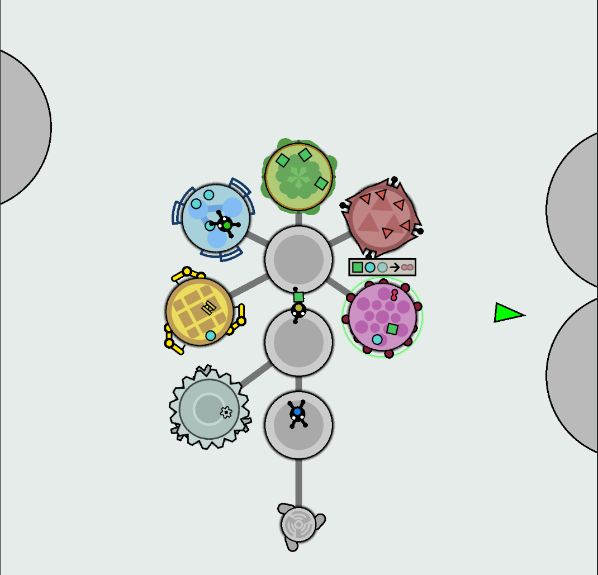
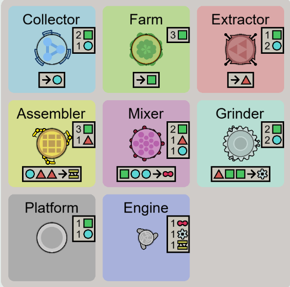

# Shotantik

A resource management game about building and managing your own ship.

[Play the game](https://denysolkhovykdev.github.io/shotantik/)



Building system:



World exploration:


## About

Shotantik is a resource management game focused on both material and time management.

The player starts with a set of basic buildings and several workers. Workers can transform resources into other resources using a crafting system and use them to construct new buildings.

By assigning commands and priorities to workers, the player can automate production and construction processes, build their own ship, and explore the world using engines.

## Features

- Resource management
- Crafting and production system
- Worker management
- Worker commands and priorities
- Building system
- Modular ship construction
- World exploration
- Time management and production planning

## Roadmap

- Combat system
  - Combat with local flora and fauna
  - Combat with enemy ships
- Procedural generation of land areas
  - Different biomes
- Quest system
- Trading with other ships
- Logic system
- Moving mechanical elements
- Dynamic ship transformations based on the situation

## Technologies

- TypeScript
- PixiJS
- Vite
- Playwright
- GitHub Pages

## Development

Install dependencies:

```bash
npm install
```

Start the development server:

```bash
npm run dev
```

Run playwright tests with:

```bash
npm run test
```
